```{=html}
<!---
- ioslides manual: 
   https://bookdown.org/yihui/rmarkdown/ioslides-presentation.html
- Compile from command-line
Rscript -e "rmarkdown::render('R_for_HPC.Rmd'); knitr::knit('R_for_HPC.Rmd', tangle=TRUE)"
-->
```
```{=html}
<!---
  Note: following css chunks are required for scrolling support beyond slide boundaries
-->
```
```{=html}
<style>
slides > slide {
  overflow-x: auto !important;
  overflow-y: auto !important;
}
slides > slide.title-slide p {
  color: black;
}
slides > slide.title-slide hgroup h1{
  color: #4C7843;
}

</style>
```
```{css, echo=FALSE}
pre {
  max-height: 300px;
  overflow-y: auto;
}
pre[class] {
  max-height: 300px;
}


```

```{css, echo=FALSE}
.scroll-300 {
  max-height: 300px;
  overflow-y: auto;
  background-color: inherit;
}
```

## 

### <https://github.com/prioriactions/teaching>

# Outline

-   ::: white
    **Features**
    :::

-   Overview

-   Toy example

-   Actual case study: The Mitchell River, Australia

-   Shiny Application

## Why {#id .class width="8%" height="8%"}?

Reproducibility, Academic use, ...

<center>{.class
width="60%" height="60%"}</center>

## Features

::: {style="float: left; width: 50%;"}
<br>

-   [Powered by **Rcpp and RcppArmadillo**]{style=""}
    

-   Find **optimal** solutions

-   Solve a specific new problem using mathematical programming

-   Ideally, fast 🙂 <br> <br>
:::

::: {style="float: left; width: 50%;"}
<center>{.class width="80%" height="80%"}</center>
:::

## Overview

[**Three**]{style="color: #B93600;"} questions: **Planning objective**,
**Optimization objective**, and **Intensity of threats**.

<center>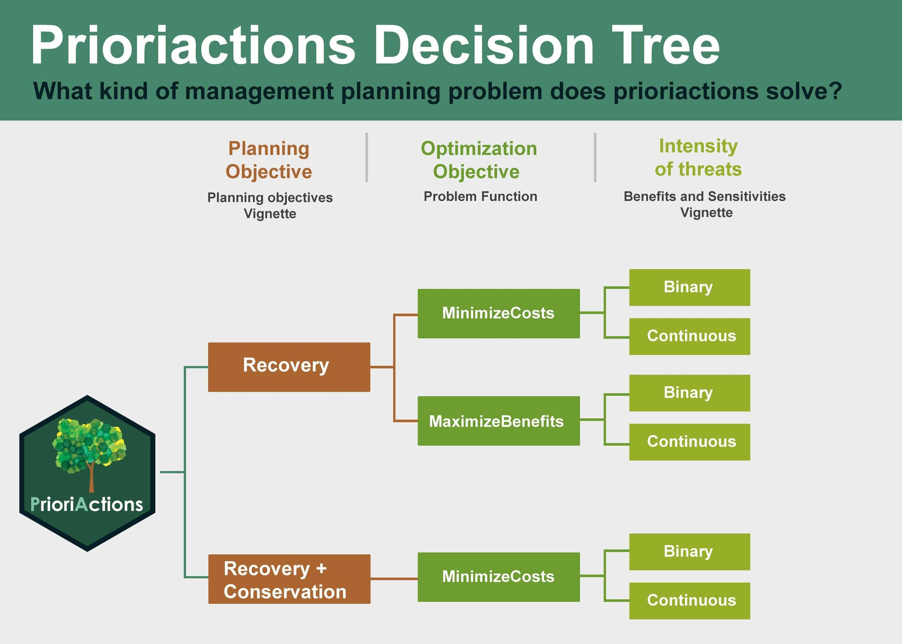{.class width="70%"
height="70%"}</center>

## Workflow

<center>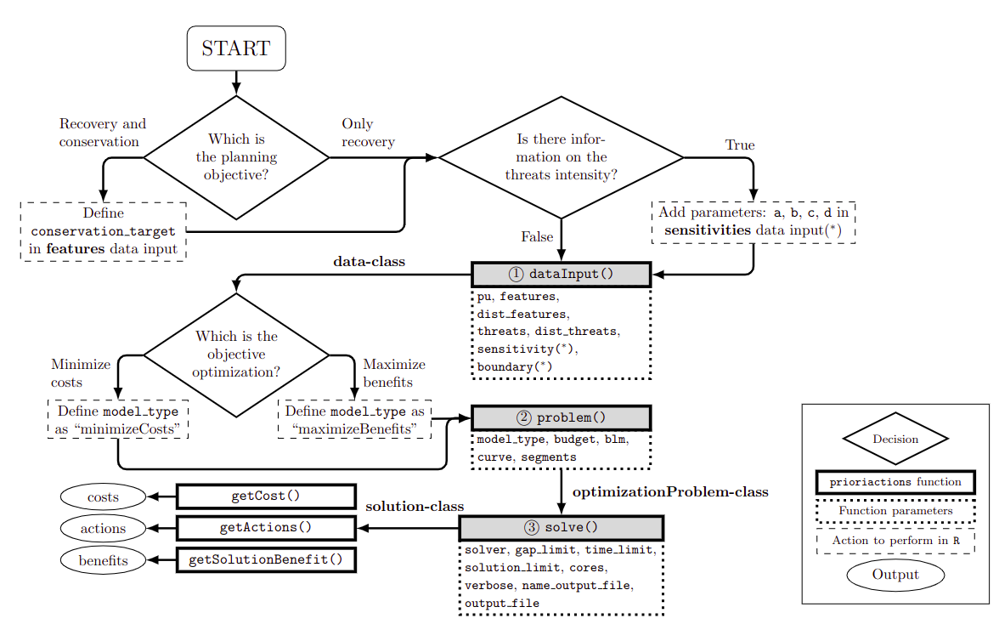{.class width="80%"
height="80%"}</center>

## [**Q1.**]{style="color: #B93600;"} Planning objective?

#### Recovery vs Conservation

<center>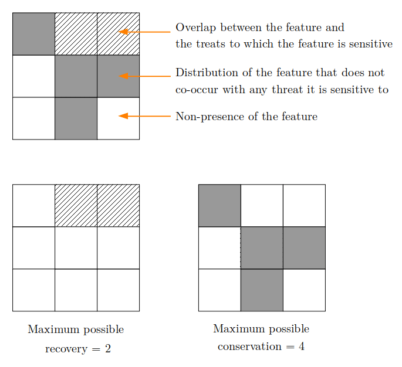{.class width="60%"
height="60%"}</center>

## Workflow

<center>{.class width="80%"
height="80%"}</center>

## [**Q2.**]{style="color: #B93600;"} Threat intensities?

#### Binary vs Continuous

<br>

<center>{.class width="80%"
height="80%"}</center>

## [**Q2.**]{style="color: #B93600;"} Threat intensities?

#### Binary vs Continuous

<br>

<center>{.class width="70%"
height="70%"}</center>

## Workflow

<center>{.class width="80%"
height="80%"}</center>

# I) Input data validation

## Inputs (`inputData()`)

Data that defines the spatial prioritization problem (**planning units
data**, **feature data**, **threats data**, and their **spatial
distributions**).

<div>

<center>[**5**]{style=""}

[**+**]{style=""} [**2**]{style=""}

[(optional)]{style=""}</center>

</div>

```{r input0_0, eval=FALSE, include=TRUE}
inputData(
  pu,
  features,
  dist_features,
  threats,
  dist_threats,
  sensitivity = NULL,
  boundary = NULL
)
```

## Inputs

**What if I have my data in another format?**<br>
[**A:**]{style="color: red;"} There are functions that allow you to
import and convert data to `data.frame` format

Examples:

```{r inputs0_1, eval=FALSE, include=TRUE}
##from .txt to data.frame
df <- read.table('myfile.txt',sep='\t')

```

```{r inputs0_2, eval=FALSE, include=TRUE}
##from .csv to data.frame
df <- read.csv("myfile.csv")

```

<center>{.class width="80%"
height="80%"}</center>

<br>

## #1 Planning units data (`pu`)

#### `data.frame`

<br> Specifies the **planning units (PU)** of the corresponding instance
and their corresponding **monitoring cost** and **status**. Each row
corresponds to a different planning unit. This file is inherited from
the *pu.dat* in Marxan. <br> <br>

::: {style="float: left; width: 50%;"}
-   [**id**]{style="color: #4385CD;"}<br> `integer` unique identifier
    for each planning unit.

-   [**monitoring_cost**]{style="color: #4385CD;"}<br> `numeric` cost of
    including each planning unit in the reserve system.

-   [**status** (optional)]{style="color: #4385CD;"}<br> `integer` value
    that indicate if each planning unit should be available to be
    selected (`0`), locked-in (`2`) as part of the solution, or
    locked-out (`3`) and excluded from the solution.
:::

::: {style="float: right; width: 40%;"}
```{r inputs1, eval=TRUE, include=TRUE}
## id monitoring_cost status
## 1                2      0
## 2                2      0
## 3                2      0
## 4                2      0
## 5                2      0
## 6                2      0
```
:::

## #1 Planning units data (`pu`)

### [**id**]{style="color: #4385CD;"}<br>

<br>

<center>{.class
width="70%" height="70%"}</center>

## #1 Planning units data (`pu`)

### [**monitoring_cost**]{style="color: #4385CD;"}<br>

<center>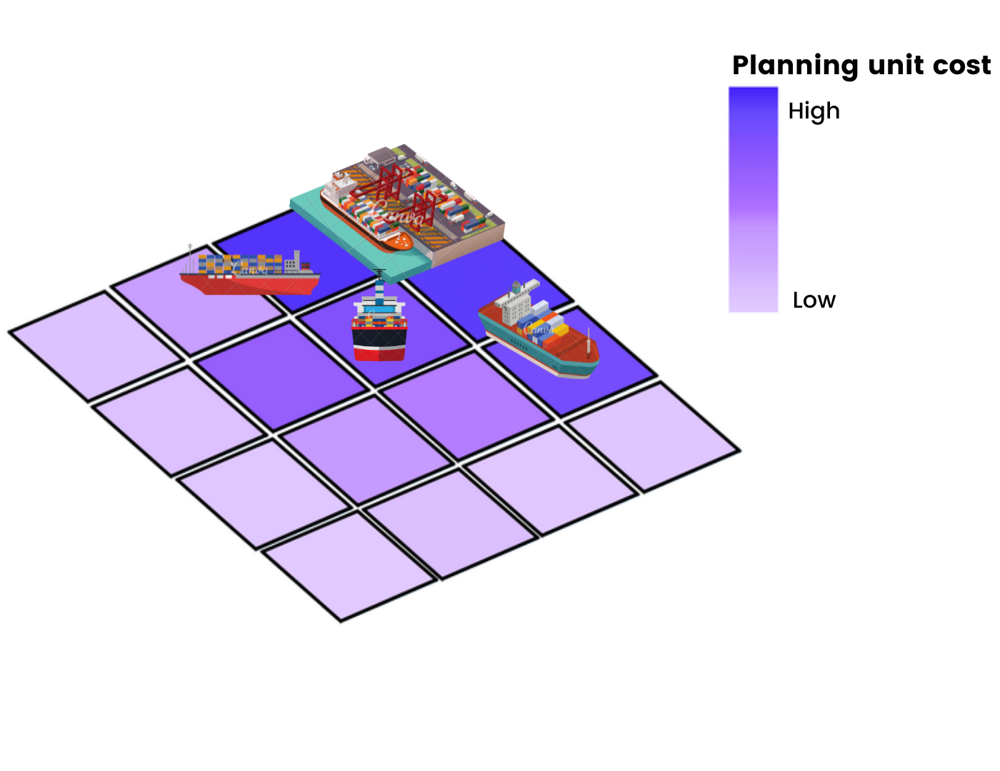{.class
width="50%" height="50%"}</center>

## #1 Planning units data (`pu`)

### [**status** (optional)]{style="color: #4385CD;"}<br>

-   free (`0`)
-   locked-in (`2`)
-   locked-out (`3`)

<center>{.class width="40%"
height="40%"}</center>

## #2 Features data (`features`)

#### `data.frame`

<br> Specifies the **conservation features** to consider in the
optimization problem. Each row corresponds to a different feature. This
file is inherited from the *spec.dat* in Marxan. <br> <br>

::: {style="float: left; width: 50%;"}
-   [**id**]{style="color: #4385CD;"}<br> `integer` unique identifier
    for each conservation feature.

-   [**target_recovery**]{style="color: #4385CD;"}<br> `numeric` amount
    of recovery target to achieve for each conservation feature.

-   [**target_conservation** (optional)]{style="color: #4385CD;"}<br>
    `numeric` amount of conservation target to achieve for each
    conservation feature.

-   [**name** (optional)]{style="color: #4385CD;"}<br> `character` name
    for each conservation feature.
:::

::: {style="float: right; width: 40%;"}
```{r inputs2, eval=TRUE, include=TRUE}
##id target_recovery     name
## 1              11 feature1
## 2              16 feature2
## 3               8 feature3
## 4               9 feature4
```
:::

## #2 Features data (`features`)

### [**id**]{style="color: #4385CD;"} (Species) <br>

<center>{.class
width="45%" height="45%"}</center>

## #2 Features data (`features`)

### [**id**]{style="color: #4385CD;"} (Ecosystem Services)<br>

<center>{.class width="45%"
height="45%"}</center>

## #2 Features data (`features`)

### [**id**]{style="color: #4385CD;"} (Habitats) <br>

<br>

<center>{.class
width="70%" height="70%"}</center>

## #2 Features data (`features`)

### [**recovery_target**]{style="color: #4385CD;"}<br>

<br>

<center>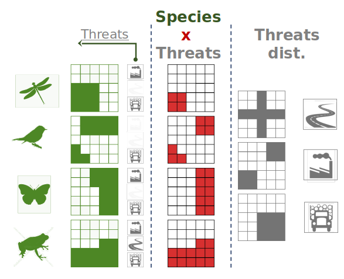{.class width="50%"
height="50%"}</center>

## #2 Features data (`features`)

### [**conservation_target (optional)**]{style="color: #4385CD;"}<br>

::: {style="float: left; width: 50%;"}
<br>

<center>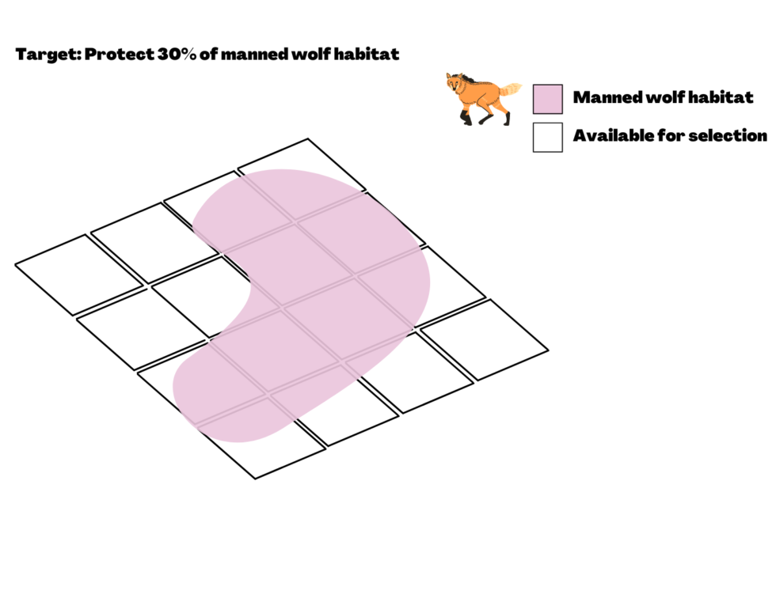{.class width="100%"
height="100%"}</center>
:::

::: {style="float: left; width: 50%;"}
<center>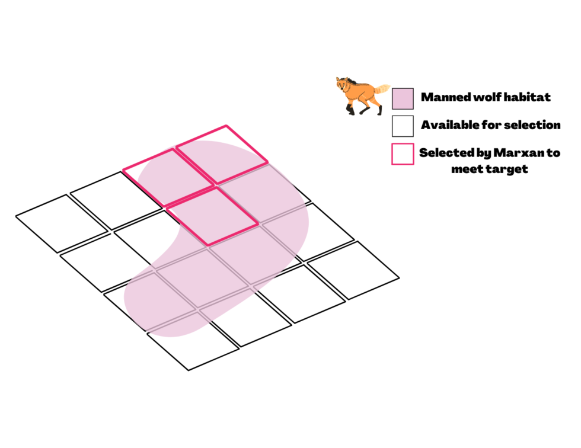{.class width="100%"
height="100%"}</center>
:::

<center>Source: <https://marxansolutions.org></center>

## #3 Distribution Features data (`dist_features`)

#### `data.frame`

<br> Specifies the **spatial distribution of conservation features**
across planning units. Each row corresponds to a combination of
`planning unit` and `feature`. <br> <br>

::: {style="float: left; width: 50%;"}
-   [**pu**]{style="color: #4385CD;"}<br> `integer` *id* of a planning
    unit where the conservation feature listed on the same row occurs.

-   [**feature**]{style="color: #4385CD;"}<br> `integer` *id* of each
    conservation feature.

-   [**amount**]{style="color: #4385CD;"}<br> `numeric` amount of the
    feature in the planning unit. Set to `1` to work with
    presence/absence.
:::

::: {style="float: right; width: 30%;"}
```{r inputs3, eval=TRUE, include=TRUE}
#pu feature amount
#1        3      1
#2        3      1
#3        3      1
#4        3      1
#5        3      1
#6        3      1
```
:::

## #3 Distribution Features data (`dist_features`)

### [**amount (binaries)**]{style="color: #4385CD;"}<br>

<center>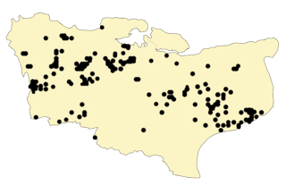{.class
width="50%" height="50%"}</center>

## #3 Distribution Features data (`dist_features`)

### [**amount (continuous)**]{style="color: #4385CD;"}<br>

<center>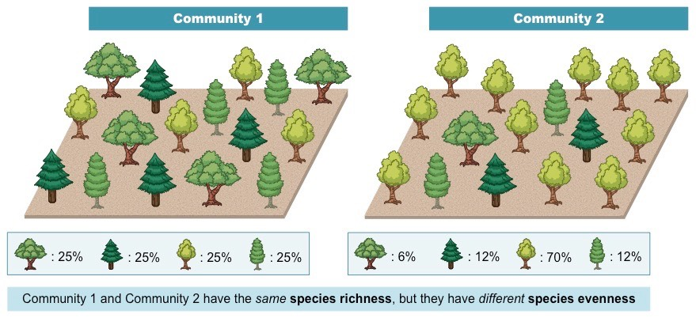{.class
width="70%" height="70%"}</center>

## #4 Threats data (`threats`)

#### `data.frame`

<br> Specifies the **threats** to consider in the optimization exercise.
Each row corresponds to a different `threats`. <br> <br>

::: {style="float: left; width: 50%;"}
-   [**id**]{style="color: #4385CD;"}<br> `integer` unique identifier
    for each threat.

-   [**blm_actions** (optional)]{style="color: #4385CD;"}<br> `numeric`
    penalty of connectivity between threats. Default is `0`.

-   [**name** (optional)]{style="color: #4385CD;"}<br> `character`
    \`name for each conservation feature.
:::

::: {style="float: right; width: 35%;"}
```{r inputs4, eval=TRUE, include=TRUE}
#>id    name blm_actions
#> 1 threat1           0
#> 2 threat2           0
```
:::

## #4 Threats data (`threats`)

### [**blm_actions**]{style="color: #4385CD;"}

<center>{.class
width="50%" height="50%"}</center>

## #5 Distribution Threats data (`dist_threats`)

#### `data.frame`

<br> specifies the **spatial distribution of threats** across planning
units. Each row corresponds to a combination of `planning unit` and
`threat`. <br> <br>

::: {style="float: left; width: 60%;"}
-   [**pu**]{style="color: #4385CD;"}<br> `integer` *id* of a planning
    unit where the threat listed on the same row occurs.

-   [**threat**]{style="color: #4385CD;"}<br> `integer` *id* of each
    conservation feature.

-   [**amount**]{style="color: #4385CD;"}<br> `numeric` amount of the
    threat in the planning unit. Set to `1` to work with
    presence/absence. Continuous amount values require that feature
    `sensitivities` to threats be established.
:::

::: {style="float: right; width: 30%;"}
```{r inputs5, eval=TRUE, include=TRUE}
#>pu threat amount action_cost status
#> 8      2      1           2      0
#> 9      2      1           2      0
#>10      2      1           2      0
#>11      1      1           3      0
#>11      2      1           4      0
#>12      1      1           3      0
```
:::

## #5 Distribution Threats data (`dist_threats`)

#### `data.frame`

<br> specifies the **spatial distribution of threats** across planning
units. Each row corresponds to a combination of `planning unit` and
`threat`. <br> <br>

-   [**action_cost**]{style="color: #4385CD;"}<br> `numeric` cost of an
    action to abate the threat in each planning unit.

-   [**status** (optional)]{style="color: #4385CD;"}<br> `integer` value
    that indicate if each planning unit should be available to be
    selected (`0`), locked-in (`2`) as part of the solution, or
    locked-out (`3`) and excluded from the solution. :::

## #5 Distribution Threats data (`dist_threats`)

### [**amount (continuous)**]{style="color: #4385CD;"}<br>

<center>{.class width="70%"
height="70%"}</center>

## #6 Sensitivity data (`sensitivity`)

### Optional

#### `data.frame`

<br> specifies the **sensitivity** of each `feature` to each `threat`.
Each row corresponds to a combination of `feature` and `threat`. <br>
<br>

::: {style="float: left; width: 70%;"}
-   [**feature**]{style="color: #4385CD;"}<br> `integer` *id* of each
    conservation feature.

-   [**threat**]{style="color: #4385CD;"}<br> `integer` *id* of each
    threat.

-   [**a** (optional)]{style="color: #4385CD;"}<br> `numeric` the
    minimum intensity of the threat at which the features probability of
    persistence starts to decline.

-   [**b** (optional)]{style="color: #4385CD;"}<br> `numeric` the value
    of intensity of the threat over which the feature has a probability
    of persistence of `0`.
:::

::: {style="float: right; width: 30%;"}
```{r inputs7, eval=TRUE, include=TRUE}
#>feature threat
#>      1      1
#>      2      1
#>      3      1
#>      4      1
#>      1      2
#>      2      2
```
:::

## #6 Sensitivity data (`sensitivity`)

### Optional

#### `data.frame`

<br> specifies the **sensitivity** of each `feature` to each `threat`.
Each row corresponds to a combination of `feature` and `threat`. <br>
<br>

-   [**c** (optional)]{style="color: #4385CD;"}<br> `numeric` minimum
    probability of persistence of a features when a threat reaches its
    maximum intensity value.

-   [**d** (optional)]{style="color: #4385CD;"}<br> `numeric` maximum
    probability of persistence of a features in absence threats. :::

## #6 Sensitivity data (`sensitivity`)

### [**a, b, c and d**]{style="color: #4385CD;"}<br>

<center>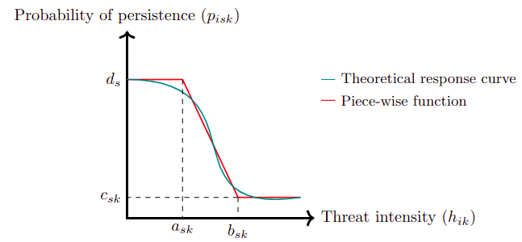{.class width="70%"
height="70%"}</center>

## #6 Sensitivity data (`sensitivity`)

### [**a, b, c and d**]{style="color: #4385CD;"}<br>

<center>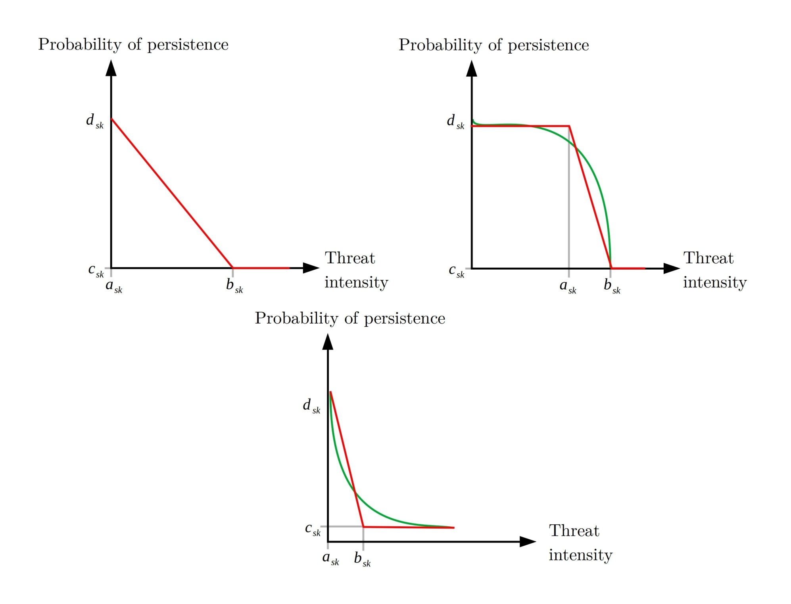{.class width="60%"
height="60%"}</center>

## #7 Boundary data (`boundary`)

### Optional

#### `data.frame`

<br> Specifies the **spatial relationship** between pair of
`planning units`. Each row corresponds to a combination of
`planning unit`. <br> <br>

::: {style="float: left; width: 60%;"}
-   [**id1**]{style="color: #4385CD;"}<br> `integer` *id* of each
    planning unit.

-   [**id2**]{style="color: #4385CD;"}<br> `integer` *id* of each
    planning unit.

-   [**boundary**]{style="color: #4385CD;"}<br> `numeric` penalty
    applied in the objective function when only one of the planning
    units is present in the solution.
:::

::: {style="float: right; width: 30%;"}
```{r inputs8, eval=TRUE, include=TRUE}
#>id1 id2 boundary
#>  1   1        0
#>  2   1        1
#>  3   1        2
#>  4   1        3
#>  5   1        4
#>  6   1        5
```
:::

## Workflow

<center>{.class width="80%"
height="80%"}</center>

## [**Q3.**]{style="color: #B93600;"} Optimization objective?

#### Minimize Costs (**`minimizeCosts`**) vs Maximize Benefits (**`maximizeBenefits`**)

<br>

<center>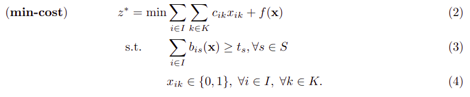{.class width="80%"
height="80%"}</center>

$x_{ik}$ is the decisions variable that specifies whether an action to
abate threat $k$ in planning unit $i$ has been selected $(1)$ or not
$(0)$.

$c_{ik}$ is the cost of the action to abate the threat $k$ in the
planning unit $i$.

$b_{is}(x)$ is the benefit of the feature $s$ in the planning unit $i$
(ranging between $0$ and $1$).

$t_s$ is the recovery target for feature $s$.

$f(x)$ is the function of connectivity penalty.

## [**Q3.**]{style="color: #B93600;"} Optimization objective?

#### Minimize Costs (**`minimizeCosts`**) vs Maximize Benefits (**`maximizeBenefits`**)

<br>

<center>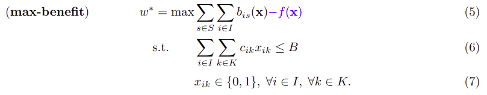{.class width="80%"
height="80%"}</center>

$x_{ik}$ is the decisions variable that specifies whether an action to
abate threat $k$ in planning unit $i$ has been selected $(1)$ or not
$(0)$.

$c_{ik}$ is the cost of the action to abate the threat $k$ in the
planning unit $i$.

$b_{is}(x)$ is the benefit of the feature $s$ in the planning unit $i$
(ranging between $0$ and $1$).

$B$ is the budget available.

$f(x)$ is the function of connectivity penalty.

## Workflow

<center>{.class width="80%"
height="80%"}</center>

# II) Create mathematical model

## Create the model (`problem()`)

Create an **optimization model** for the multi-action conservation
planning problem, following the mathematical formulations used in
Salgado-Rojas et al. (2020).

<br>

```{r model1, eval=FALSE, include=TRUE}
problem(
  x,
  model_type = "minimizeCosts",
  budget = 0,
  blm = 0
)
```

## Workflow

<center>{.class width="80%"
height="80%"}</center>

# III) Solve model

## Solve model (`solve()`)

Solves the **optimization model** associated with the multi-action
conservation planning problem. This function is used to solve the
mathematical model created by the `problem()` function.

<br>

```{r solve1, eval=FALSE, include=TRUE}
solve(
  a,
  solver = "",
  gap_limit = 0,
  time_limit = .Machine$integer.max,
  solution_limit = FALSE,
  cores = 2,
  verbose = TRUE,
  name_output_file = "output",
  output_file = TRUE
)
```

## Solve model (`solve()`)

### [**solver**]{style="color: #4385CD;"} (`gurobi, cplex, symphony`)<br>

<br>

<div>

<center>

**Rsymphony** <br>

<center>


</div>

## Solve model (`solve()`)

### [**gap limit**]{style="color: #4385CD;"} (percentage) <br>

<center>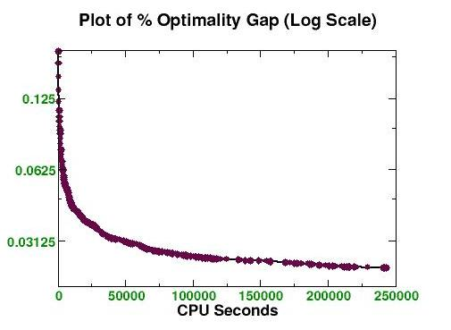{.class
width="60%" height="60%"}</center>

## Solve model (`solve()`)

### [**time limit**]{style="color: #4385CD;"} (seconds) <br>

### [**solution_limit**]{style="color: #4385CD;"} (First solution?) <br>

### [**verbose**]{style="color: #4385CD;"} (Information on screen?) <br>

## Overview

<center>{.class width="80%"
height="80%"}</center>

# Getting information of solutions

## `getActions()`

Returns the spatial deployment of the **actions for each planning unit**
of the corresponding solution.

<br>

```{r info1, eval=FALSE, include=TRUE}
getActions(x, format = "wide")
```

Output example,

```{r info2, eval=FALSE, include=TRUE}
##   solution_name pu 1 2 conservation connectivity
## 1           sol  1 0 0            0            0
## 2           sol  2 0 0            0            0
## 3           sol  3 0 0            0            0
## 4           sol  4 0 0            0            0
## 5           sol  5 0 0            0            0
## 6           sol  6 0 0            0            0
```

## `getSolutionBenefit()`

Returns the **total benefit** induced by the corresponding solution. The
total benefit is computed as the sum of the benefits obtained, for all
features, across all the units in the planning area.

<br>

```{r info3, eval=FALSE, include=TRUE}
getSolutionBenefit(x, type = "total")
```

Output example,

```{r info4, eval=FALSE, include=TRUE}
##   solution_name feature benefit.conservation benefit.recovery benefit.total
## 1           sol       1                    0               11            11
## 2           sol       2                    0               16            16
## 3           sol       3                    0               10            10
## 4           sol       4                    0                9             9
```

## `getCost()`

Provides the sum of **costs** to actions and monitoring applied in a
solution.

<br>

```{r info5, eval=FALSE, include=TRUE}
getCost(x)
```

Output example,

```{r info6, eval=FALSE, include=TRUE}
##   solution_name monitoring threat_1 threat_2
## 1           sol         61       20       65
```

# Outline

-   Features

-   ::: white
    **Toy example**
    :::

-   Overview

-   Actual case study: The Mitchell River, Australia

-   Shiny Application

## Package installation and documentation

<!-- badges: start -->


[](https://lifecycle.r-lib.org/articles/stages.html#stable)
[](https://github.com/prioriactions/prioriactions/actions)
[](https://cran.rstudio.com/web/packages/prioriactions/index.html)

<!-- badges: end -->

Package `prioriactions` can be found at
[CRAN](https://cloud.r-project.org/web/packages/prioriactions/index.html),
so it can be installed using:

```{r toyExample1, eval=FALSE, include=TRUE}
install.packages("prioriactions")
```

Latest stable versions can be downloaded and installed from GitHub as
follows (package `remotes` should be installed first):

```{r toyExample2, eval=FALSE, include=TRUE}
if (!require(remotes)) install.packages("remotes")
remotes::install_github("prioriactions/prioriactions")
```

So, we load the `prioriactions` package.

```{r toyExample3, eval=TRUE, include=TRUE}
# load package
library(prioriactions)
```

## Toy Example

##### (Available in the [Get Started](https://prioriactions.github.io/prioriactions/articles/prioriactions.html) vignette on the `prioriactions` website)

<br />

-   This example contains **100 planning units**, **4 features** and **2
    threats**.

-   The distribution of features and threats can be plotted on a grid of
    10 x 10 units.

-   `prioriactions` contains this simulated example inside the setup
    files. You can extract it by the `data()` function.

## #1 Planning units data

The monitoring cost values ranging from 1 to 10 and all status of 0 (not
locked).

```{r toyExample4, eval=TRUE, message=FALSE, include=TRUE}
# load planning unit data from prioriactions
data(sim_pu_data) #To load simulated data

#head(sim_pu_data)
```

```{r toyExample5, echo=FALSE, message=FALSE}
library(DT)
datatable(sim_pu_data, rownames = FALSE, options = list(pageLength = 5))
```

## #1 Planning units data

A `RasterLayer` object can be used to present this spatial information.
The pixel values correspond to the **monitoring costs** of each planning
unit.

```{r toyExample6, eval=TRUE, message=FALSE, include=TRUE, out.width="60%"}
library(raster) #To plot rasters

r <- raster(ncol=10, nrow=10, xmn=0, xmx=10, ymn=0, ymx=10)
values(r) <- sim_pu_data$monitoring_cost
plot(r)
```

## #2 Features data

Contains information about the **features** such as its *id* and
*targets* (mandatory when `minimizing costs`).

```{r toyExample7, eval=TRUE, message=FALSE, include=TRUE}
# load features data from prioriactions
data(sim_features_data)

#head(sim_features_data)
```

```{r toyExample8, echo=FALSE, message=FALSE}
datatable(sim_features_data, rownames = FALSE, options = list(pageLength = 5))
```

## #3 Features distribution data

Contains information on the **spatial distribution of these features**
across planning units.

```{r toyExample9, eval=TRUE, message=FALSE, include=TRUE}
# load features data from prioriactions
data(sim_dist_features_data)

#head(sim_features_data)
```

```{r toyExample10, echo=FALSE, message=FALSE}
datatable(sim_dist_features_data, rownames = FALSE, options = list(pageLength = 5))
```

## #3 Features distribution data

To plot the spatial distribution of the first feature,

```{r toyExample10_1, eval=TRUE, message=FALSE, include=TRUE}
# load amount of features data
features <- reshape2::dcast(sim_dist_features_data, 
                            pu~feature,
                            value.var = "amount", 
                            fill = 0)

values(r) <- features$`1`
plot(r)
```

## #3 Features distribution data

<center>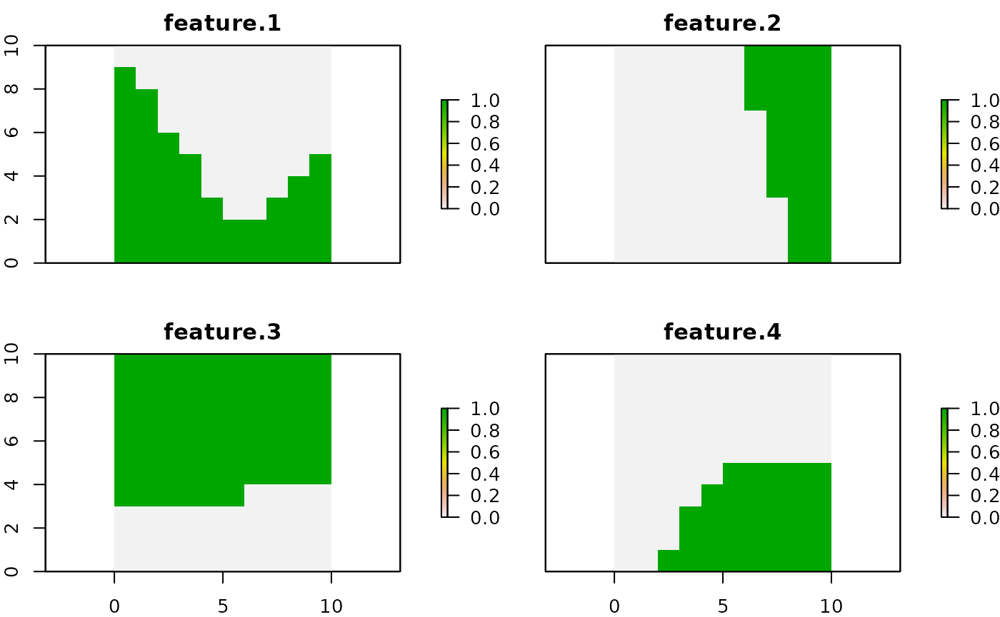{.class width="80%"
height="80%"}</center>

## #4 Threats data

Provides information about the threats such as their `id` and `name`.

```{r toyExample11, eval=TRUE, message=FALSE, include=TRUE}
# load threats data from prioriactions
data(sim_threats_data)
```

```{r toyExample12, echo=FALSE, message=FALSE}
datatable(sim_threats_data, rownames = FALSE, options = list(pageLength = 5))
```

## #5 Threats distribution data

Provides information on the **spatial distribution** of these threats

```{r toyExample13, eval=TRUE, message=FALSE, include=TRUE}
# load threats data from prioriactions
data(sim_dist_threats_data)
```

```{r toyExample14, echo=FALSE, message=FALSE}
datatable(sim_dist_threats_data, rownames = FALSE, options = list(pageLength = 5))
```

## #5 Threats distribution data

<center>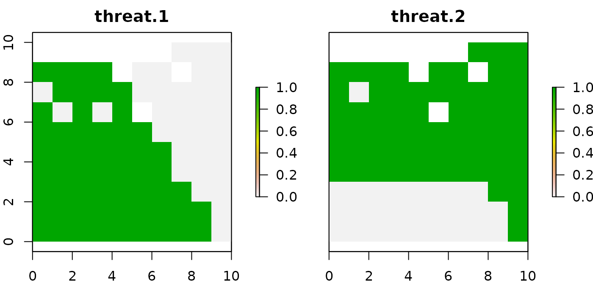{.class width="80%"
height="80%"}</center>

## #6 Sensitivity data

Indicates which features is sensitive to what threat.

```{r toyExample15, eval=TRUE, message=FALSE, include=TRUE}
# load threats data from prioriactions
data(sim_sensitivity_data)
```

```{r toyExample16, echo=FALSE, message=FALSE}
datatable(sim_sensitivity_data, rownames = FALSE, options = list(pageLength = 5))
```

## #7 Boundary data

Provides information on the **spatial relationship** between PU and they
are presented in long format.

```{r toyExample17, eval=TRUE, message=FALSE, include=TRUE}
# load boundary data from prioriactions
data(sim_boundary_data)
```

```{r toyExample18, echo=FALSE, message=FALSE}
datatable(sim_boundary_data, rownames = FALSE, options = list(pageLength = 5))
```

## Step 1: Initialize the problem

After having loaded our data, we will now create the data object through
the `inputData()` function.

```{r toyExample19, echo=TRUE, message=FALSE}
# create conservation problem
b <- inputData(pu = sim_pu_data, 
               features = sim_features_data, 
               dist_features = sim_dist_features_data, 
               threats = sim_threats_data, 
               dist_threats = sim_dist_threats_data, 
               sensitivity = sim_sensitivity_data, 
               boundary = sim_boundary_data)

# print problem
print(b)
```

```{r toyExample20, echo=FALSE, message=TRUE, warning=TRUE}
# print problem
print(b)
```

## Step 1: Initialize the problem

It is advisable to determine the maximum benefit achievable for each
conservation feature through the `getPotentialBenefit()` function

```{r toyExample21, echo=TRUE, message=TRUE, warning=TRUE}
# get benefit information
getPotentialBenefit(b)
```

## Step 2: Create the mathematical model

```{r toyExample22, echo=TRUE, message=TRUE, warning=TRUE}
# create optimization problem
c <- problem(b, model_type = "minimizeCosts")

# print model
print(c)
```

## Step 3: Solve the model

To solve our model, we need an **optimizer**. In this case, we will use
the `Rsymphony` library.

```{r toyExample23, echo=TRUE, message=TRUE, warning=TRUE}
# solve optimization problem
d <- solve(c, solver = "symphony", verbose = TRUE, output_file = FALSE, cores = 2)

# print solution
print(d)
```

## Getting information

#### `getActions()`

```{r toyExample24, echo=TRUE, message=TRUE, warning=TRUE}
# get actions from solution
actions <- getActions(d, format = "wide")

# print first six rows of data
# head(actions)
```

```{r toyExample24_2, echo=FALSE, message=FALSE}
datatable(actions, rownames = FALSE, options = list(pageLength = 5))
```

## Getting information

#### `getActions()`

```{r toyExample25, echo=TRUE, message=TRUE, warning=TRUE}
values(r) <- actions$`1`
plot(r)
```

## More connectivity?

#### We go back to step 2 and repeat.

<br>

```{r toyExample26, echo=TRUE, message=TRUE, warning=TRUE}
# create optimization problem
c2 <- problem(b, model_type = "minimizeCosts", blm = 10)

# print model
print(c2)
```

## More connectivity?

```{r toyExample27, echo=TRUE, message=TRUE, warning=TRUE}
# solve optimization problem
d2 <- solve(c2, solver = "symphony", verbose = TRUE, output_file = FALSE, cores = 2)

# print solution
print(d2)
```

```{r toyExample28, echo=TRUE, message=TRUE, warning=TRUE}
# get actions from solution
actions2 <- getActions(d2, format = "wide")

values(r) <- actions2$`1`
plot(r)

```

# Outline

-   Features

-   Overview

-   Toy example

-   ::: white
    **Actual case study: The Mitchell River, Australia**
    :::

-   Shiny Application

## The Mitchell River, Australia

- We divided the whole catchment (71,630 km2) into **2316 sites** (i.e., sub-catchments)

- We sourced the distribution of **45 fish species** in the Mitchell river catchment as our conservation features. 

- We considered **four major threats** to freshwater fish species in the catchment: `water buffalo` (Bubalis bubalis), `cane toad` (Bufo marinus), `river flow alteration` (caused by infrastructure for water extractions and levee banks) and `grazing land use`.

<center>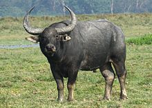{.class
width="40%" height="40%"}</center>


## The Mitchell River, Australia

<center>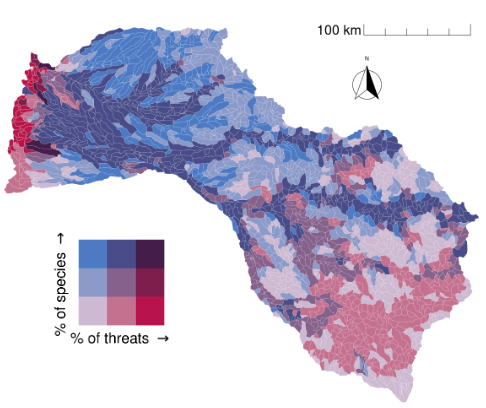{.class
width="60%" height="60%"}</center>

# Outline

-   Features

-   Overview

-   Toy example

-   Actual case study: The Mitchell River, Australia

-   ::: white
    **Shiny Application**
    :::

## Shiny Application

<center>{.class
width="80%" height="80%"}</center>

## Shiny Application

### https://prioriactions.shinyapps.io/prioriactions/

<center>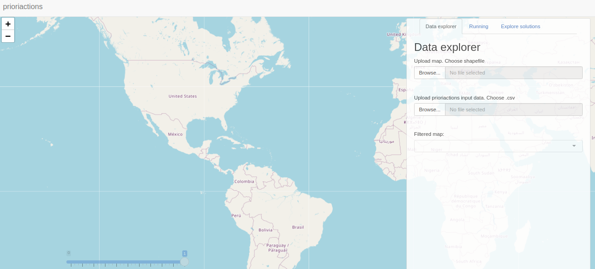{.class
width="80%" height="80%"}</center>

# Thank you!

## Questions?

<br>

<center>{.class
width="25%" height="25%"}</center>


